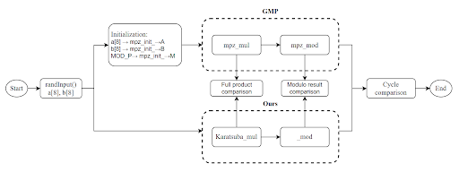

# PQC-final-project
Benchmark large integer multiplication on the Raspberry Pi and compare with mpz_mul provided by GMP.


## Brenchmark
using brenchmark tools [aarch64-bench](https://github.com/mkannwischer/aarch64-bench.git)

### How to build the test platform
```bash
git clone https://github.com/mkannwischer/aarch64-bench.git
cd aarch64-bench/
make CYCLES=PERF
sudo ./bench
```
and the terminal will show CPU cycle count as follows:
```bash
$ ./bench 
 
       ntt cycles = 992
 
           percentile      1     10     20     30     40     50     60     70     80     90     99
 
       ntt percentiles:    989    992    992    992    992    992    992    992   1017   1022   1202
```

## Implementation
### Parameter Settings
* Operand size:
We perform 256-bit × 256-bit multiplication.
* Representation (Limbs = 8):
    - Each operand is represented using uint32_t × 8 limbs (32 bits × 8 = 256 bits).  
    - The result after multiplication has 16 limbs (512 bits) before reduction.    
* Modulus:
    - We reduce the result modulo: P = 2^{256}-1    
        which allows fast modular reduction via wrap-around addition.
    - MOD_P for GMP:    
        The same modulus 2256-1 is imported into GMP as:     
        uint32_t MOD_P[LIMBS] = { 0xFFFFFFFF, 0xFFFFFFFF, 0xFFFFFFFF, 0xFFFFFFFF, 
                                0xFFFFFFFF, 0xFFFFFFFF, 0xFFFFFFFF, 0xFFFFFFFF }

### System Architecture 
We use Karatsuba Multiplication to improve 256*256 bits multiplication, and schoolbook multiplication for 128×128-bit sub-multiplication.


### Correctness Verification
Run following command to see the correctness.
```bash
gcc -O3 -mcpu=cortex-a72 -funroll-loops -Wall \
    -o test_mul \
    test_mul.c group7/mul512_kara.c group7/schoolbook256_mul.S \
    -lgmp && ./test_mul
```


